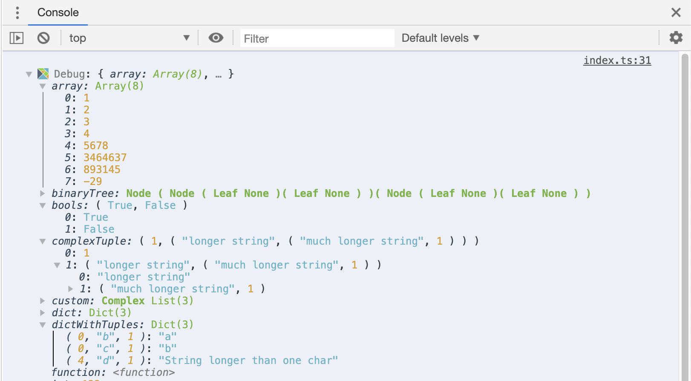

<div align="center">
    <h1>Elm Debug Transformer</h1>
    <a href="https://badge.fury.io/js/elm-debug-transformer">
      
    </a>
    <p>Transform Elm Debug.log output into nice log object with custom formatter</p>
</div>

The standard Elm `Debug.log` console output:


and the same output with this package 



The main module exposes `register()` function that replaces your `console.log()` and try to parse each incoming message with Elm parser. If it fails, it would pass the original message.

## Installation

Just install this module with:

```
yarn add -D elm-debug-transformer
```

## Usage

Register the console debugger in your main JS file before you initialize Elm application:

```
import * as ElmDebugger from 'elm-debug-transformer';

ElmDebugger.register();

// rest of application
```

### Enable custom formatters in Chrome dev tools
Available in Chrome 47 and higher.

The output object is kind of chatty right now (it carries information about parsed type etc. - less verbose version is worked on right now). 

If your browser have Chrome dev toools, you can enable custom formatters so you get less noice and nice output.

  - Open DevTools
  - Go to Settings ("three dots" icon in the upper right corner of DevTools > Menu > Settings F1 > Preferences > Console)
  - Check-in "Enable custom formatters"
  - Close DevTools
  - Open DevTools

Note: You might need to refresh the page first time you open Console panel with existing logs - custom formatters are applied only to newly printed console messages.

### Simple object output

```
import ElmDebugger from 'elm-debug-transformer';

ElmDebugger.register({simple_mode: true});
```

If you are not a fan of Chromium based browser you can pass option to the `register` function. 
```
register({simple_mode: true});
``` 

That way the `Debug.log` would output simpler JS object without `type` information. `Tuple`, `Set`, `Array` and `List` would become arrays and `Dict` would become JS object with keys and values.

## Credits

This would probably not see the light of the day without [Matt Zeunert](https://github.com/mattzeunert) and his [blogpost](https://www.mattzeunert.com/2016/02/19/custom-chrome-devtools-object-formatters.html) about writing custom formatters. Thank you!

